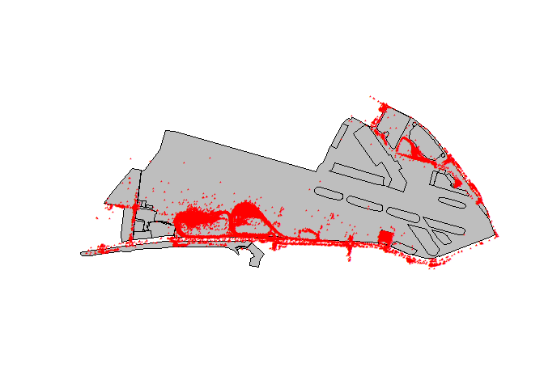
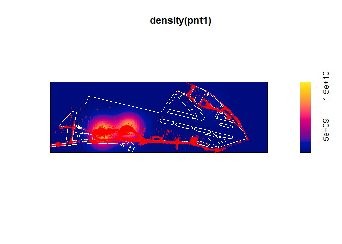
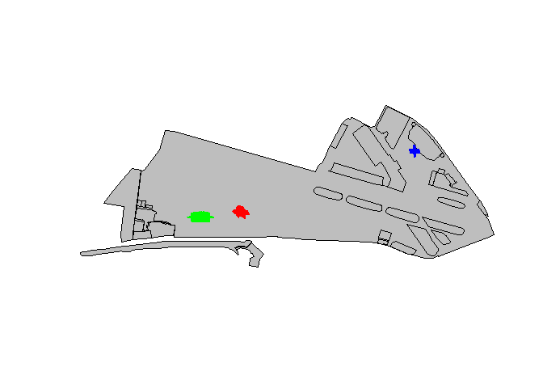
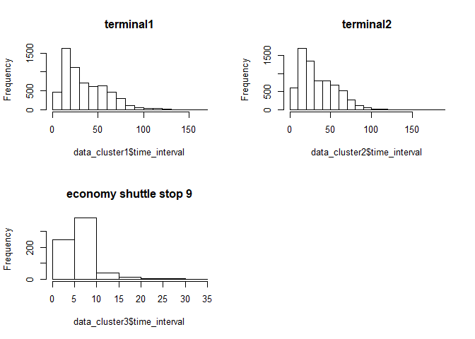

Spatial analysis on airport vehicles
================
Zhongjia Wei
11/30/2018

Importing libraries
-------------------

``` r
library(sp, lib.loc="E:/R/R-3.5.1/library")  

library(raster, lib.loc="E:/R/R-3.5.1/library")

library(rgdal, lib.loc="E:/R/R-3.5.1/library")
```

    ## rgdal: version: 1.3-6, (SVN revision 773)
    ##  Geospatial Data Abstraction Library extensions to R successfully loaded
    ##  Loaded GDAL runtime: GDAL 2.2.3, released 2017/11/20
    ##  Path to GDAL shared files: E:/R/R-3.5.1/library/rgdal/gdal
    ##  GDAL binary built with GEOS: TRUE 
    ##  Loaded PROJ.4 runtime: Rel. 4.9.3, 15 August 2016, [PJ_VERSION: 493]
    ##  Path to PROJ.4 shared files: E:/R/R-3.5.1/library/rgdal/proj
    ##  Linking to sp version: 1.3-1

Loading data
------------

``` r
dir<-"D:/data/grouproject"
air_vehicles_csv<-file.path(dir,"airport.csv")
airport_shp<-file.path(dir,"complete_airport.shp")
air_vehicles<-read.csv(air_vehicles_csv, header = TRUE, sep = ",")
boundary1<-readOGR(airport_shp)
```

    ## OGR data source with driver: ESRI Shapefile 
    ## Source: "D:\data\grouproject\complete_airport.shp", layer: "complete_airport"
    ## with 30 features
    ## It has 1 fields
    ## Integer64 fields read as strings:  id

``` r
coords <- air_vehicles[ , c("X", "Y")]   # coordinates
data   <- air_vehicles[ , 2:7]          # data
crs    <- CRS("+init=epsg:4326")
d<- SpatialPointsDataFrame(coords = coords,
                               data = data, 
                               proj4string = crs)
CRS.new <- CRS("+proj=lcc +lat_1=32.78333333333333 +lat_2=33.88333333333333 +lat_0=32.16666666666666 +lon_0=-116.25
+x_0=2000000 +y_0=500000.0000000001 +datum=NAD83 +units=us-ft +no_defs +ellps=GRS80 +towgs84=0,0,0 ")
d.proj <- spTransform(d, CRS.new)
coords_proj <- coordinates(d.proj)
coords_d <- coordinates(d)
```

Plot all the points
-------------------

``` r
plot(boundary1,col="gray",border="black")

plot(d,pch='*',col='red',cex=.5,add=TRUE)
```



Density map of all points
-------------------------

``` r
library(spatstat, lib.loc="E:/R/R-3.5.1/library")
pnt1=ppp(d$X,d$Y,c(min(d$X),-117.17),
       c(min(d$Y),max(d$Y)))
```

    ## Warning: 130 points were rejected as lying outside the specified window

    ## Warning: data contain duplicated points

``` r
plot(density(pnt1),0.01)
plot(boundary1,col="transparent",border="white",add=TRUE)
plot(d,pch='*',col='red',cex=.5,add=TRUE)
```

 \#So,although the points may look dispersed, the majority of them actually gather in T1 and T2

DBscan clustering
-----------------

``` r
library("dbscan", lib.loc="E:/R/R-3.5.1/library")

#only subset 15000 points inorder to ensure the best clustering results
d1<-head(coords_proj,15000)

res <- dbscan(d1, eps =10, minPts = 15)
res
```

    ## DBSCAN clustering for 15000 objects.
    ## Parameters: eps = 10, minPts = 15
    ## The clustering contains 6 cluster(s) and 1202 noise points.
    ## 
    ##    0    1    2    3    4    5    6 
    ## 1202 6136 6920  686   22   19   15 
    ## 
    ## Available fields: cluster, eps, minPts

``` r
airvehicles<-head(air_vehicles,15000)
#Only subset the first 3 clusters
cluster1<-airvehicles[res$cluster %in% 1,]
cluster2<-airvehicles[res$cluster %in% 2,]
cluster3<-airvehicles[res$cluster %in% 3,]

coords_cluster1 <- cluster1[ , c("X", "Y")] 
data_cluster1   <- cluster1[ , 2:7]  
coords_cluster2 <- cluster2[ , c("X", "Y")] 
data_cluster2   <- cluster2[ , 2:7]  
coords_cluster3 <- cluster3[ , c("X", "Y")] 
data_cluster3   <- cluster3[ , 2:7]  

crs    <- CRS("+init=epsg:4326")
d_cluster1<- SpatialPointsDataFrame(coords = coords_cluster1,
                               data = data_cluster1, 
                               proj4string = crs)
d_cluster2<- SpatialPointsDataFrame(coords = coords_cluster2,
                               data = data_cluster2, 
                               proj4string = crs)
d_cluster3<- SpatialPointsDataFrame(coords = coords_cluster3,
                               data = data_cluster3, 
                               proj4string = crs)

plot(boundary1,col="gray",border="black")

#terminal1
plot(d_cluster1,col="red",add=TRUE)
#terminal2
plot(d_cluster2,col="green",add=TRUE)
#economy shuttle stop 9
plot(d_cluster3,col="blue",add=TRUE)
```

 \#\#calculate the average time vehicles spent in different pickup/dropoff places

``` r
data_cluster1$time_interval<-as.numeric(difftime(strptime(data_cluster1$Time.of.exit,"%H:%M"),strptime(data_cluster1$Time.of.entry,"%H:%M")))
data_cluster1$time_interval[data_cluster1$time_interval<0]<-1440+data_cluster1$time_interval[data_cluster1$time_interval<0]

data_cluster2$time_interval<-as.numeric(difftime(strptime(data_cluster2$Time.of.exit,"%H:%M"),strptime(data_cluster2$Time.of.entry,"%H:%M")))
data_cluster2$time_interval[data_cluster2$time_interval<0]<-1440+data_cluster2$time_interval[data_cluster2$time_interval<0]

data_cluster3$time_interval<-as.numeric(difftime(strptime(data_cluster3$Time.of.exit,"%H:%M"),strptime(data_cluster3$Time.of.entry,"%H:%M")))
data_cluster3$time_interval[data_cluster3$time_interval<0]<-1440+data_cluster3$time_interval[data_cluster3$time_interval<0]
```

``` r
#Average time spent in Terminal 1(From entering the airport and leave the airport):
mean(data_cluster1$time_interval)
```

    ## [1] 35.69638

``` r
#Average time spent in Terminal 2(From entering the airport and leave the airport):
mean(data_cluster2$time_interval)
```

    ## [1] 34.70925

``` r
#Average time spent in economy shuttle stop 9(From entering the airport and leave the airport):
mean(data_cluster3$time_interval)
```

    ## [1] 6.857143

Showing the distribution of time in 3 clusters
----------------------------------------------

``` r
par(mfrow=c(2,2))
hist(data_cluster1$time_interval,main="terminal1")
hist(data_cluster2$time_interval,main="terminal2")
hist(data_cluster3$time_interval,main="economy shuttle stop 9")
```


